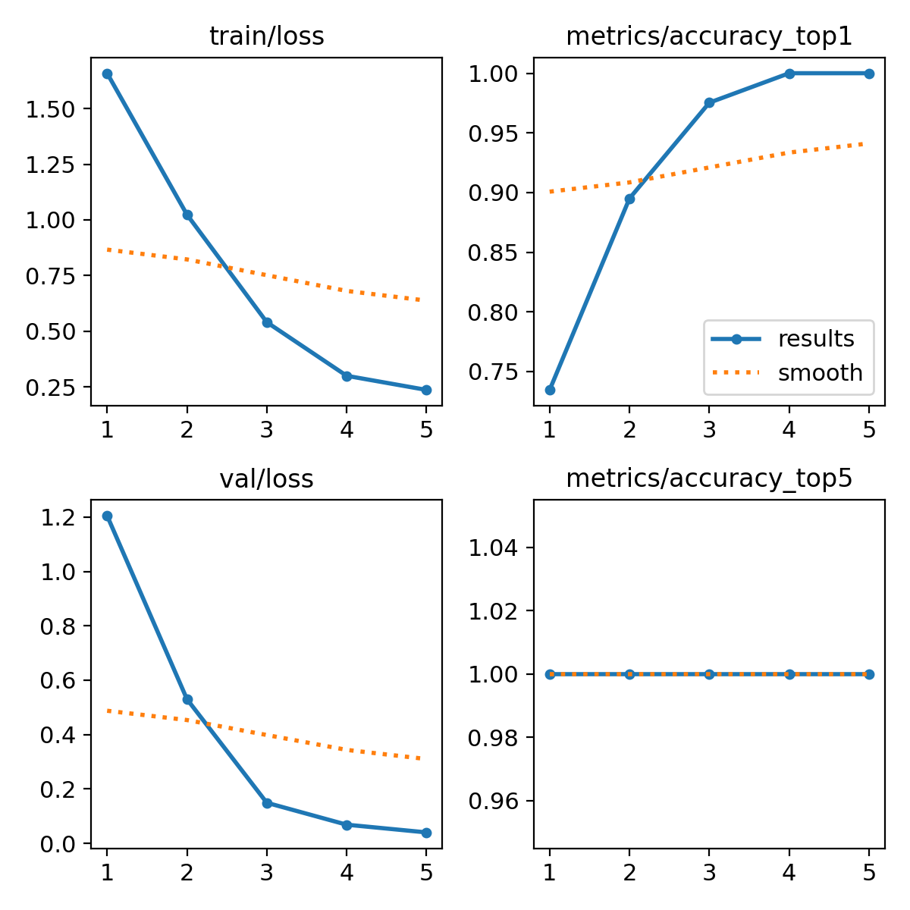
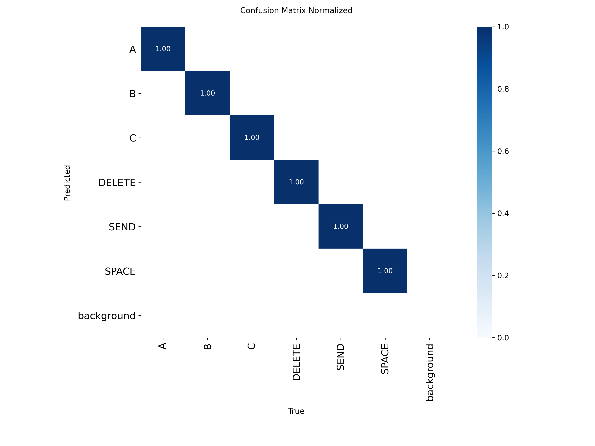

# Tradutor de Libras em Tempo Real 🤟

Um sistema interativo e em tempo real para a tradução de sinais da Língua Brasileira de Sinais (LIBRAS), focado na análise de gestos para controle e comunicação contínua (Baseado no Tema 4).

**Equipe:** [INSERIR NOME DOS INTEGRANTES AQUI]

## 🎯 Tema Escolhido e Tarefa YOLO
- **Tema escolhido:** Análise de Gestos e Comunicação em LIBRAS.
- **Tarefa YOLO:** Classificação de Imagens. O sistema analisa cada frame da câmera em tempo real para prever qual sinal/letra a pessoa está executando.
- **Modelo base utilizado:** `yolov8n-cls.pt` (variante Nano).
- **Justificativa da escolha:** O modelo Nano é rápido, não exige GPUs potentes e permite com que a inferência aconteça simultaneamente junto ao servidor web na mesma máquina e processador comum. O problema de libras, quando capturado diretamente pela câmera do usuário em um enquadramento focado nas mãos, adapta-se muito bem a uma classificação de imagens.

## 🗂️ Descrição do Dataset
- **Origem:** Próprio (coletado totalmente do zero pela equipe usando o nosso próprio script `collect_yolo_images.py`).
- **Tamanho:** Cerca de 800 imagens.
- **Classes anotadas/definidas:** A, B, C, SPACE, DELETE, e SEND.
- **Anotação:** O dataset já consistiu dos recortes crus (*raw_images*) focados, eliminando a dependência de caixas deliberadas no Label Studio nesse primeiro momento.
- **Split:** Código automatizou a divisão de 80% Treino e 20% Validação no ato do treinamento.

## 🚀 Resultados do Treinamento
Foi obtida uma taxa incrível de acurácia com as classes propostas:
- **Top-1 Accuracy:** ~1.00 nas validações.

### Gráficos e Métricas
Abaixo, os relatórios gerados automaticamente pelo motor Ultralytics YOLO:

**Treino e Validação (Loss / Accuracy):**


**Matriz de Confusão Normalizada:**


Todos arquivos brutos, bem como o arquivo de peso `best.pt`, encontram-se exportados na pasta `model/`.

## 🏗️ Arquitetura da Aplicação
`[ WebCam ] ---> (YOLOv8 Inferência Local) <===> [ FastAPI Servidor ] <---Polling HTTP---> [ Interface Web GUI ]`

Enquanto uma thread secundária processa ininterruptamente os frames da webcam e guarda em variáveis a pontuação, letra e confiança, a interface do usuário fica perguntando a cada `200ms` à API como está o status atual para atualizar visualmente as barras na tela.

## 🔌 Endpoints da API
- **`GET /`**
  - **Entrada:** Nenhuma.
  - **Saída:** Apenas renderiza a árvore de componentes da página em HTML estático `index.html`.
- **`GET /status`**
  - **Entrada:** Nenhuma.
  - **Saída:** JSON que retorna as variáves mantidas pelo motor IA.
    `(texto, mensagem, letra, confianca, restante)`.

## 🛠️ Tecnologias Utilizadas
- **[Python](https://www.python.org/)** - Base de todo projeto.
- **[Ultralytics YOLO](https://docs.ultralytics.com/)** - Treinamento de pesos próprios e inferências neurais.
- **[FastAPI](https://fastapi.tiangolo.com/)** - Servidor web assíncrono super ágil.
- **[OpenCV](https://opencv.org/)** - Extratagem de imagens e manipulação da câmera matricial.
- **HTML/CSS/JS (Vanilla)** - Lado do cliente bonito e fluido, com a barra animada de "carregamento" do tempo de confirmação da letra detectada.

## ⚙️ Como Executar Localmente
1. **Instale as bibliotecas:**
   ```bash
   pip install -r requirements.txt
   ```
2. **Execute o API via Uvicorn:**
   ```bash
   uvicorn api:app --reload
   ```
3. **Página:** Acesse `http://127.0.0.1:8000` via o navegador. O script buscará a câmera de índice 0.

---
**Nota sobre arquivos descartáveis:** Na raiz, um arquivo `prep_and_train_yolo.py` acompanha a solução caso você queira re-treinar o modelo a partir do zero nas imagens criadas no `dataset/raw_images`.
